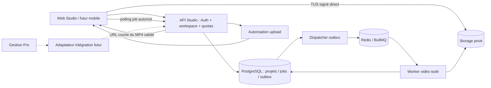

# ELSATIA Studio V1 — Architecture proposée

Statut : proposition du 12 septembre 2026, non implémentée. Le domaine Studio est autonome ; identité et services transversaux ELSATIA peuvent être partagés via des contrats explicites.

## 1. Choix techniques

| Couche | Choix recommandé | Motif |
|---|---|---|
| Web | Next.js 16.2.12, React 19.2.4, TypeScript, Tailwind 4 | Continuité du dépôt ; application `apps/studio`, build et déploiement propres |
| Domaine | Packages TS sans React/Next/Supabase | Timeline reproductible, accessible aux tests, au worker et au futur mobile |
| Identité | Supabase Auth ELSATIA existant, IdentityAdapter | Pas de nouveaux mots de passe ; inscription Studio sans entreprise obligatoire |
| Données | PostgreSQL 17/Supabase, SQL versionné et RLS | Cohérence du repo ; tables `public.studio_*` pour éviter d’exposer un nouveau schéma API |
| Upload | Supabase Storage privé, TUS et tokens signés ; `tus-js-client` à qualifier | Reprise directe navigateur → stockage, sans traversée du serveur Next |
| Stockage | ObjectStorageAdapter ; Supabase premier fournisseur | Contrat incluant uploads reprenables, HEAD, lecture partielle, signature, suppression ; adaptateurs S3/R2 futurs |
| Orchestration | RenderJob + outbox PostgreSQL ; BullMQ et Redis dédiés | Jobs durables, dispatch rejouable, tentatives et progression ; DB source d’autorité |
| Worker | Node 24 + FFmpeg/ffprobe dans une image Linux figée | CPU/mémoire/disque isolés du serveur web ; MP4 H.264/AAC |
| Analyse | Métadonnées + heuristiques en worker ; IA optionnelle derrière interface | Disponible même sans fournisseur IA ; aucune suppression automatique |
| Vérification | Vitest, pgTAP, Playwright, tests réels FFmpeg | Déjà cohérents avec le dépôt ; compléter CI |
| Observabilité | Sentry adapté, logs JSON, métriques workers | Aucune URL signée ni média/EXIF dans les traces |

Les nouvelles dépendances sont proposées, pas installées. Les versions FFmpeg, BullMQ, Redis et TUS seront sélectionnées, verrouillées et testées au lot A/E ; aucun numéro « latest » flottant en exploitation.

### Comparaison du rendu

| Option | Atouts | Limites pour ce besoin | Décision |
|---|---|---|---|
| FFmpeg seul + moteur TS | Décodage, coupe, audio, crop, transitions et encodage dans le même worker | Prévisualisation interactive à simplifier ; typographie complexe plus coûteuse à développer | **Choix V1**, preview du vrai MP4 puis nouveau rendu après édition |
| Remotion + FFmpeg | Compositions React, textes élaborés, player interactif | Runtime supplémentaire, coût de rendu à mesurer, conditions de licence à qualifier | Alternative si le spike révèle un besoin graphique insuffisamment couvert |
| FFmpeg WASM / MediaRecorder navigateur | Démonstration locale, fichiers privés | Gros médias, mémoire mobile, onglet suspendu et codecs/export non uniformes | Pas le moteur d’acceptation commercial MP4 |
| FFmpeg dans une route Next | Déploiement apparent simple | Traitement long et lourd lié aux ressources du serveur web | Exclu |

FFmpeg documente les filtres `zoompan`, `xfade`, `drawtext`, `overlay`, `afade`, `loudnorm`. Leur disponibilité exacte dépendra de l’image figée. [Documentation FFmpeg](https://ffmpeg.org/ffmpeg-filters.html). Remotion propose une approche vidéo programmatique ; sa licence doit être vérifiée avant adoption. [Documentation Remotion](https://www.remotion.dev/docs), [licensing](https://www.remotion.dev/docs/licensing). Les obligations dépendent du build FFmpeg et de ses bibliothèques : validation dédiée avant distribution/commercialisation. [Informations FFmpeg](https://ffmpeg.org/legal.html).

## 2. Frontières et flux

Arborescence future : `apps/studio` (UI et API), `packages/studio-domain` (schémas/timeline/templates), `packages/studio-contracts` (DTO/adapters), `workers/studio-video` (processing/rendu), `supabase/migrations` (lot canonique), `tests/studio` (fixtures/intégration). Pas d’import `@/lib/entreprise` depuis Studio et pas de jointure chantier/devis. Les packages communs éventuels doivent être extraits en petits lots testés pour les apps existantes.

## 3. Workspaces, identité et autorisations

`User` correspond à `auth.users` et au profil commun existant ; aucune nouvelle table de mots de passe. Un workspace Studio peut être personnel, professionnel ou entreprise ; un utilisateur a plusieurs appartenances. Un espace personnel est créé transactionnellement et idempotemment à l’onboarding, sans fabriquer d’entreprise Gestion Pro. Une éventuelle référence d’organisation ELSATIA passe par un mapping d’intégration distinct, sans FK métier.

Le catalogue commun expose Studio via un adaptateur. Les entitlements individuels Tools constituent un précédent mais leurs niveaux free/pro ne doivent pas être surchargés pour simuler PERSONAL/BUSINESS. L’adaptateur traduit des capacités autorisées ; les plans Studio appartiennent au domaine Studio. Le bootstrap FREE personnel est un contrat transversal à définir explicitement au lot A, sans auto-attribution d’un rôle plateforme ou entreprise.

| Action | owner | admin | editor | viewer |
|---|---|---|---|---|
| Voir projets et rendus de son workspace | oui | oui | oui | oui |
| Créer/modifier projets, importer, rendre | oui | oui | oui | non |
| Télécharger un rendu autorisé | oui | oui | oui | oui |
| Créer/révoquer un partage externe, gérer Brand Kit | oui | oui | non | non |
| Gérer membres (hors owner), rétention | oui | oui | non | non |
| Transférer propriété, supprimer workspace | oui | non | non | non |

Défense en API **et** RLS : `auth.uid()` et membership actif ; workspace reçu du navigateur jamais accepté sans contrôle. FKs composites `(workspace_id, id)` empêchent d’associer un asset d’un autre tenant. Dernier owner protégé par transaction verrouillée. Pas de bypass métier automatique pour un administrateur global. Le worker a une identité technique minimale, une revendication de job et un périmètre d’objets bornés ; pas de service_role général embarqué dans un décodeur.

## 4. Schéma logique proposé

Conventions : UUID, dates `timestamptz`, tailles `bigint`, temps vidéo en frames entières à 30 fps, JSON versionné validé à l’entrée. Toute table métier tenant porte `workspace_id`, y compris les enfants. Les blobs sont uniquement dans Storage. Les relations listées sont conceptuelles : aucune migration n’est créée dans ce passage.

| Modèle / table proposée | Champs principaux | Relations et contraintes |
|---|---|---|
| User / Auth commun | id, profil existant | Identité commune ; FK vers auth.users seulement quand requise |
| Workspace / studio_workspaces | id, name, kind, retention_days, created_by, deleted_at | kind personal/professional/business ; owner via membership |
| WorkspaceMember / studio_workspace_members | workspace_id, user_id, role, status | PK composite ; rôle borné ; dernier owner protégé |
| Project / studio_projects | id, name, type, target_frames, format, template_id/version, context_json, cover_asset_id, active_timeline_id, revision, deleted_at | 7 types ; contexte chantier/voyage validé, pas de FK chantier |
| MediaAsset / studio_media_assets | id, object_key, original_name, declared_mime, detected_mime, bytes, sha256, width, height, duration_frames, rotation, captured_at, date_source, status, analysis_json | Clé Storage générée ; statut quarantine/ready/rejected/deleted ; hashes limités au workspace |
| ProjectAsset / studio_project_assets | id, project_id, asset_id, position, included, phase, caption, source_in/out | Ordre explicite ; exclusion réversible ; suppression projet ne détruit pas un asset encore référencé |
| Timeline / studio_timelines | id, project_id, version, fps, total_frames, schema_version, template_snapshot, manifest_json, hash, engine_version | UNIQUE(project_id, version) ; snapshot figé et hash autoritaire |
| TimelineClip / studio_timeline_clips | id, timeline_id, asset_id, track_id, start_frame, end_frame, duration_frames, source_in/out, crop, scale, rotation, transition_in/out, volume, playback_rate, effects | end-start=duration>0 ; source bornée ; projection transactionnelle du manifeste |
| Transition / studio_transitions | id, timeline_id, from_clip_id, to_clip_id, kind, duration_frames, params | cut/dissolve/fade/slide/zoom ; paramètres allowlist, aucun filtre brut |
| AudioTrack / studio_audio_tracks | id, timeline_id, asset_id, start_frame, source_in/out, gain, muted, fade_in/out, loop | Audio importé comme asset ; durée bornée ; original video audio par clip |
| TextOverlay / studio_text_overlays | id, timeline_id, start/end_frame, role, text, style_json, position | Intro/chapitre/légende/outro ; texte borné, jamais HTML ou expression FFmpeg |
| BrandingOverlay / studio_branding_overlays | id, timeline_id, brand_snapshot, logo_asset_id, position, start/end_frame, watermark | Snapshot versionné ; autorisations watermark imposées serveur |
| Template / studio_templates | id, code, version, config_json, published, premium | Catalogue global readonly client ; UNIQUE(code, version) |
| BrandKit / studio_brand_kits | id, name, logo_asset_id, colors, company, slogan, phone, email, website, social_json | Un ou plusieurs kits par workspace ; aucun fetch d’URL arbitraire pour logo |
| RenderJob / studio_render_jobs | id, timeline_id, output_profile, status, progress, attempt, max_attempts, lease_token, heartbeat_at, cancel_requested_at, error_code, idempotency_key, started/finished_at | Clé idempotente par workspace ; transitions atomiques ; version worker et hash entrée |
| RenderOutput / studio_render_outputs | id, job_id, object_key, bytes, sha256, codec, audio_codec, width, height, duration_frames, validated_at, expires_at | Une sortie publiée par job/profil ; références assets validées avant publication |
| Export / studio_exports | id, output_id, requested_by, created_at | Événement d’autorisation téléchargement, pas preuve d’un téléchargement terminé |
| ShareLink / studio_share_links | id, output_id, token_hash, expires_at, revoked_at, created_by | Jeton opaque, aucune URL signée persistée ; lien lié à une version de rendu |
| SubscriptionPlan / studio_subscription_plans | code, version, limits_json, capabilities, watermark_policy | FREE/PERSONAL/PRO/BUSINESS préparés ; aucun Stripe activé |
| WorkspacePlan / studio_workspace_plans | workspace_id, plan_code/version, starts_at, ends_at | Une version applicable ; attribution serveur uniquement |
| UsageCounter / studio_usage_counters | workspace_id, period_start, metric, used, reserved | UNIQUE(workspace,period,metric) ; réservations atomiques anti-course |
| UsageEvent / studio_usage_events | id, job_or_upload_id, metric, quantity, event_key | UNIQUE(event_key) ; ledger évite double facturation après retry |
| AuditLog / studio_audit_logs | id, actor_id, action, resource_id, result, created_at | Append-only ; metadata allowlist sans média, token, GPS ni contenu sensible |
| UploadSession / studio_upload_sessions | id, project_id, asset_id, key, expected_bytes, status, expires_at | Réservation et finalisation idempotente ; compteur réel confirmé par stockage |
| JobOutbox / studio_job_outbox | id, job_id, event_type, created_at, dispatched_at | Écrit dans transaction du job ; dispatch rejouable et reconciliation |
| IntegrationMapping / studio_integration_mappings | id, source, external_project_id, project_id, request_hash | UNIQUE(workspace,source,external_project_id) ; pas de FK vers Gestion Pro |

`manifest_json` est la source canonique de la timeline : les tables clips/audio/overlays sont ses projections relationnelles écrites dans la même transaction, jamais deux documents modifiables indépendamment. Les tracks simples du manifeste couvrent vidéo, musique, son original, texte et branding ; l’UI n’affiche que les blocs de médias.

Index prioritaires : memberships `(user_id,status)`, projets `(workspace_id,updated_at,id)`, assets `(workspace_id,status)`, jobs `(workspace_id,status,created_at)`, outbox non distribuée, shares par hash. FKs restrictives pour snapshots rendus ; purge orchestrée au lieu de cascades silencieuses qui laisseraient des objets orphelins.

## 5. Upload et analyse

1. API valide session, rôle editor+, projet actif, MIME déclaré, nom d’affichage et taille. Réserve nombre d’assets et octets dans une transaction ; génère UUID et clé objet, sans nom utilisateur dans le chemin.
2. Crée UploadSession et autorisation d’upload dans `studio-originals`, privé/quarantaine logique. Client transfère par TUS directement au Storage ; concurrence limitée, progression réelle, pause/retry et reprise après réseau coupé. Le rechargement peut nécessiter la resélection du fichier sur mobile : ne pas promettre un accès persistant au fichier local.
3. La finalisation vérifie objet/taille avec Storage, jamais le seul JSON client ; transaction idempotente. Elle crée un job de preprocessing. Un upload abandonné expire et libère ses quotas ; rejet libère après suppression effective.
4. Worker lit les octets, détecte format et pistes avec ffprobe, inspecte métadonnées et décode une image/échantillon. Bornes durée, pixels, frames, mémoire, CPU et scratch ; images de décompression massive et vidéos invalides rejetées. Pas de décodage lourd dans Next.
5. Génère miniatures/proxies et score indicatif : luminosité, flou heuristique, hash exact et perceptuel, ratio, durée, orientation. La déduplication est intra-workspace et ne supprime rien. Dates EXIF originales puis métadonnées vidéo ; fuseau et origine conservés, fallback documenté date fichier puis import. Tri stable date + ordre initial ; correction manuelle disponible.
6. Publication `ready` atomique. UI montre dimensions, poids, durée, date et provenance, orientation/ratio, statut et suggestions. HEIC possible seulement si le décodeur worker qualifié le supporte ; message de conversion si indisponible. HDR/VFR/rotation normalisés selon profil documenté.

Object keys proposées : `workspaces/{workspaceId}/projects/{projectId}/assets/{assetId}/original`, `/proxies/...`, `/renders/{jobId}/{attemptId}/...`, `/brand-kits/...`. Aucun nom ni adresse utilisateur dans les clés. Objets immuables, `upsert:false`, HEAD et contrôle checksum ; chiffrement, CORS exact et expiration des tokens.

Supabase documente les uploads reprenables ainsi que l’utilisation de tokens signés avec TUS. Le support réel des limites du projet choisi et de la reprise doit être testé. [Documentation officielle](https://supabase.com/docs/guides/storage/uploads/resumable-uploads).

## 6. Timeline et templates

Le moteur TS reçoit uniquement des médias `ready` sélectionnés et un contexte validé. Il conserve tous les médias choisis ; une durée irréalisable produit une explication, jamais une suppression silencieuse. Ordre par phases pour chantier, date stable pour voyage/vacances, ordre manuel pour libre. L’IA propose des données ; l’utilisateur peut les accepter avant création du snapshot.

Temps à 30 fps : `T = somme(durées clips) - somme(recouvrements) + intro + outro`. Distribuer les frames par méthode déterministe du plus grand reste, sous contraintes de durée minimale et de durée disponible pour les vidéos. Les overrides manuels ont priorité ; si impossibles, demander un ajustement explicite. Aucun vide, source hors bornes ou transition plus longue que ses voisins. Trim début/fin, crop/letterbox, volume original et cover restent éditables simplement.

Photos : contain/cover, point focal ajustable, zoom lent borné et léger pan. Vidéos : in/out, correction orientation, débit/format standardisés, conservation du son à gain réglable. Musique : gain, mute, fade, répétition optionnelle annoncée. Écrans intro/outro inclus dans la durée cible. La position du logo et les marges sûres s’adaptent au ratio.

| Template versionné | Base | Rythme proposé | Transition dominante | Structure |
|---|---|---|---|---|
| Chantier Pro | Professionnel / Chantier | photos 4 s | dissolve bref | intro, phases attribuées, résultat, outro entreprise |
| Chantier Dynamique | Dynamique | photos 2 s | cut | plans courts, résultat final, logo |
| Avant / Après | Avant / Après | photos 4 s | dissolve | groupes avant/résultat ; demander leur attribution si absents |
| Voyage | Voyage | photos 3 s | slide discret | chronologie, chapitres jour facultatifs |
| Cinématique | Cinématique | photos 5 s | dissolve lent | titre sobre, pan/zoom très faible |
| Souvenir | Souvenir / Élégant / Minimal | photos 4–5 s | fade | titre, légendes facultatives, écran final |

Ce sont des defaults ajustés à la durée cible. Les neuf styles sont des presets structurés, pas des branches dans les composants UI. Configuration inclut typo embarquée/licenciée, overlays, safe areas, zoom, transition, intro/outro, musique. Cut/dissolve/fade/slide/zoom léger sont V1 ; blur uniquement si son coût et sa qualité sont validés. Pas de promesse de classification automatique des étapes d’un chantier sans preuve : l’utilisateur peut les attribuer.

Le manifeste conserve engineVersion, templateVersion, asset checksums, sources, effets, texte, fonts, profil et seed. Un même manifeste produit la même composition. Une égalité binaire des MP4 entre matériels/builds différents n’est pas promise ; image worker figée et checks visuels/temporels définissent la reproductibilité testée.

## 7. Rendu, reprise et annulation

API `POST /api/v1/projects/{id}/renders` : valide snapshot, accès, quotas et capacité ; crée job + outbox + réservation dans **une transaction** ; renvoie 202/jobId. Le dispatcher permanent pousse BullMQ avec un jobId stable. Redis ne contient ni octets de médias ni URL signées longues durées ; perdre Redis permet de reconstruire les jobs depuis la DB.

États : `queued → preprocessing → analyzing → rendering → encoding → completed`, ou `failed` / `cancelled`. Les étapes déjà validées peuvent être franchies sans refaire leur travail. Rendu compose les segments ; encoding final assemble et encode H.264/AAC en MP4 `yuv420p`, 30 fps, audio 48 kHz, faststart. Profils 1080 : 1920×1080, 1080×1920, 1080×1080, 1080×1350 ; profils 720 : 1280×720, 720×1280, 720×720, 720×900. Pas de 4K active.

Un worker revendique le job via lease/token atomique, revalide projet/assets, télécharge en streaming dans un scratch dédié, génère un graphe allowlist et lance FFmpeg via tableau d’arguments `spawn`, sans shell. Texte via fichiers/overlays sûrs, pas d’interpolation dans une expression filtre. Worker non-root, réseau du décodeur bloqué, sorties bornées, pas de protocoles FFmpeg permettant un fetch arbitraire. Les accès Storage restent dans la couche d’orchestration contrôlée.

Progression : étape réelle + frames encodées issues de `-progress`, conservées par tentative ; jamais 100 % avant upload et vérification ffprobe/checksum de la sortie. Publication transactionnelle conditionnée au lease courant, absence d’annulation/suppression, quota et unicité output. Téléchargement autorisé uniquement depuis un RenderOutput validé.

Retry : erreurs transitoires réseau/worker avec 3 tentatives maximum, backoff exponentiel + jitter ; format invalide, quota et entrée incohérente non retentés automatiquement. Compteurs et publication idempotents. Un heartbeat expiré invalide l’ancien lease avant relance ; un worker ancien ne peut publier. Retry manuel crée une nouvelle exécution liée au snapshot et à l’échec précédent, sans modifier un job terminal. BullMQ fournit tentatives et backoff, mais la cohérence métier reste à implémenter côté DB. [Documentation BullMQ](https://docs.bullmq.io/guide/retrying-failing-jobs).

Annulation : flag persistant même si Redis indisponible ; retrait si queued, signal au process group sinon, terminaison forcée après délai borné. Course fin/annulation arbitrée par transaction ; fichiers non publiés nettoyés. Watchdog purge les scratch abandonnés ; un sweep Storage supprime les uploads incomplets et les tentatives orphelines. Pas de promesse de reprise à la frame exacte : réutiliser seulement les intermédiaires validés ; sinon relancer le segment/job.

## 8. Partage, suppression, IA et intégration

Partage V1 : URL applicative à token aléatoire 256 bits ; hash en base, expiration/révocation, accès au seul rendu choisi, aucune liste d’originaux. Résolution délivre une URL Storage courte après contrôle ; révocation effective au plus tard à expiration de cette URL (objectif 5 min). Lecture HTTP Range testée. Pas de publication sociale automatique.

Suppression projet : tombstone immédiat, révocation partages, annulation jobs, purge asynchrone originals/proxies/rendus non référencés et libération quotas après suppression confirmée. L’asset partagé avec un projet dupliqué reste tant qu’il est référencé. Suppression compte Studio distincte de suppression du compte ELSATIA global : préserver les autres apps et gérer transfert du dernier owner. La rétention configurable couvre aussi logs et backups, avec délais documentés ; aucun effacement instantané promis dans toutes les sauvegardes.

`MediaAnalysisProvider`, `TextSuggestionProvider` et `MusicCatalogProvider` sont des interfaces. Heuristiques locales par défaut ; aucune IA requise pour exporter. Suggestions validées et figées, timeout/circuit breaker, journal d’usage séparé. Pas de reconnaissance d’identité faciale en V1 ; éventuelle détection de zone visage à qualifier, désactivée par défaut. GPS facultatif/minimal ; pas de carte complexe. Aucune musique commerciale intégrée ni utilisation des médias pour entraîner des modèles.

Intégration future `POST /integrations/gestion-pro/projects` : scope `studio.projects:create`, workspace autorisé, idempotency key, version du payload. Champs chantierId/name, clientName, city, company, prestations, logo et médias ; mapping séparé. Préférer des références échangées par l’adaptateur à des URL arbitraires. Si URL sources acceptées : whitelist origine/bucket, HTTPS, contrôle DNS et redirections à chaque fetch, interdiction IP privées/metadata, limites taille/temps et checksum. Copie dans Storage Studio après autorisation, source expirée retry explicite ; aucune jointure ni FK aux tables Gestion Pro.

## 9. Décisions effectives du Lot A Foundation

Le Lot A implémente uniquement Auth/workspaces/members dans `apps/studio` et les contrats `packages/studio-domain`. Les autres sections restent la cible des lots futurs.

- Next **16.3.5** et sharp **0.35.4** sont verrouillés dans Studio : l’audit npm de 16.2.12/0.35.3 signalait des vulnérabilités critiques/élevées. Les versions des autres applications restent inchangées.
- Tables effectives `studio_workspaces` et `studio_workspace_members`, avec `workspace_type=personal|professional`, `owner_user_id`, IDs de membership et `deleted_at`. Le type business, les statuts d’invitation et les objets vidéo restent futurs.
- Owner unique et immuable pour A ; index unique + FK composite différée garantissent sa présence. Pas de transfert développé. Les mutations directes sont interdites : droits owner/admin exécutés par RPC SECURITY DEFINER, search_path vide, auth.uid() et rôle revérifiés sous verrou workspace. Lectures par RLS membre.
- Création personnelle **guidée par POST**, idempotente et sérialisée par utilisateur. Aucun effet de bord d’onboarding sur GET. Un utilisateur avec des workspaces existants arrive directement dans l’un de ses espaces.
- Workspace actif porté par le paramètre de route `workspace`, vérifié sur chaque lecture/mutation ; un identifiant explicitement inaccessible ne provoque pas de fallback. Pas de cookie de préférence nécessaire dans A.
- Auth uniquement serveur : cookies Studio distincts et HttpOnly, Secure en production, pas de client navigateur Supabase. La session Studio et la session Gestion Pro sont séparées, tout en utilisant la même identité Auth.
- Foundation est accessible aux utilisateurs authentifiés via leurs memberships. Catalogue/sélecteur multi-app, plans et entitlements commerciaux restent différés : aucun changement du socle d’habilitations ELSATIA dans A.
- Archivage logique owner uniquement ; membres conservés mais rendus invisibles par RLS. Purge physique, suppression de compte propriétaire et invitations email restent explicitement hors A.

Détails et preuves : [rapport Lot A](ELSATIA-STUDIO-V1-LOT-A-REPORT.md).

## 10. Décisions effectives du Lot B Media Upload

La demande Lot B exclut explicitement FFmpeg et les workers : la cible d’analyse asynchrone de la section 5 reste future. Le lot implémente le stockage et une inspection légère bornée, sans montage ni Lot C.

- `studio_projects` minimal : workspace, nom, type construction/travel/event/free, auteur et dates. L’association asset/projet est directe avec FK composite tenant ; pas de duplication/partage d’asset entre projets dans B.
- `studio_media_assets` porte la réservation idempotente, l’emplacement privé, les métadonnées minimales et les tombstones. Une table de limites configure images/vidéos/projet/workspace/compteur/concurrence. Réservations sérialisées par workspace.
- Upload TUS signé vers la route Supabase `/upload/resumable/sign`, en chunks de 6 Mio, hors Next. Reprise dans l’onglet uniquement. Formats qualifiés : JPEG/PNG/WEBP statiques et MP4/MOV H.264 avec conteneur non fragmenté exploitable ; pas de HEIC/HEVC/WEBM annoncés.
- Inspection par Range, maximum 4 Mio, 16 requêtes et budget réseau de 45 secondes par tentative ; cache du préfixe déjà lu. Dimensions, durée et rotation selon métadonnées disponibles. Pas d’extraction GPS/date/appareil et pas de garantie de décodage de toutes les frames.
- L’authentification, les rôles et les politiques Lot A restent inchangés. Le proxy reçoit seulement les origines CSP nécessaires aux transferts/aperçus Storage et aux previews blob. Une politique Storage restrictive interdit les opérations directes des rôles navigateur sur le bucket Studio.
- Signature/inspection/finalisation/purge dans un module serveur à credential privilégié, après autorisation utilisateur par RLS. Aucun credential privé ou token de session Auth envoyé au client. Le token d’upload signe un seul chemin avec upsert interdit ; taille réelle vérifiée à la confirmation.
- Preview privée de 60 s, chargée sur demande ; pagination média par 24. Suppression logique immédiate, purge physique après 30 h pour couvrir admission, token et TUS, quotas conservés jusque-là. Réconciliation manuelle locale, sans planification Production.

Le sens de `ready` est limité à l’admission au stockage. La qualification codecs complète et le rendu appartiennent aux lots ultérieurs. Le secret Storage possède des privilèges étendus au niveau fournisseur et nécessite une gestion rigoureuse avant toute mise en ligne ; le contrat décrit aussi les coûts de quarantaine et la durée des capacités déjà délivrées.

Détails : [contrat Storage](ELSATIA-STUDIO-STORAGE-CONTRACT.md) et [rapport Lot B](ELSATIA-STUDIO-V1-LOT-B-REPORT.md).

## 11. Décisions effectives du Lot C Projects

Le projet devient un objet de configuration, sans timeline ni rendu. Sept types stables (construction/travel/wedding/birthday/event/memory/free), description/lieu/dates, status draft/ready/archived, format 9:16/16:9/1:1/4:5 et durée automatique ou entière 1–600 s. Les champs chantier client/entreprise/prestations sont du texte Studio facultatif, sans FK Gestion Pro. Sauvegarde explicite et révision pour refuser une édition ou un ordre périmés.

La relation directe du Lot B est conservée comme **provenance d’upload**, et complétée par `studio_project_assets(workspace_id,project_id,asset_id,sort_order)`. Les références deviennent l’autorité d’appartenance aux projets ; leurs FKs composites empêchent un mélange de tenants. Le backfill conserve les assets et leurs clés, avec ordre created_at/id. Aucun fichier Storage déplacé ni copié.

Dupliquer crée un projet draft, ses paramètres, sa couverture et ses références dans le même ordre. Seuls les projets dont tous les imports référencés sont validés peuvent être dupliqués. Chaque copie possède son ordre propre ; le workspace conserve un seul asset physique et un seul coût d’octets par original. Retirer un média enlève seulement la référence du projet courant. Supprimer un projet enlève ses références ; le dernier retrait seulement crée le tombstone physique. Les archives conservent leurs références et restent consultables/restaurables. Un trigger interdit de marquer supprimé un asset encore référencé ; la réconciliation vérifie aussi les références avant suppression Storage.

La RLS média suit les références de projets accessibles et non supprimés : une copie garde l’accès après suppression du projet source. La couverture est une image ready référencée par ce même projet, garantie par FK et garde SQL. Signature/preview/TUS et formats Lot B conservés. Ordre manuel avec boutons clavier/drag-drop, sauvegarde atomique de l’ensemble des références, tri captured_at puis created_at confirmé. Ce n’est pas une timeline.

Owner/admin/editor créent/modifient/dupliquent et gèrent les médias actifs ; owner/admin seulement archivent/restaurent/suppriment un projet. Viewer reste readonly. Projet archivé readonly mais duplicable par editor+. Les mutations partagent le verrou workspace Foundation ; ses tables, rôles et cookies sont inchangés. La lecture Auth vérifiée tolère une seule reprise réseau/5xx ; un refus Auth reste refusé, sans recours à une session non vérifiée.

Liste paginée par 24, recherche littérale et filtres/tris SQL ; compteurs agrégés dans une RPC par liste, sans N+1 par carte. Dashboard compte les médias physiques une seule fois. Couvertures privées chargées sur demande. API projet bornée à 64 Kio pour l’ordre complet, API upload maintenue à 4 Kio ; aucun média binaire dans Next.

Rollback destructif réservé à un schéma projet vide de recette ; sur données réelles, rollback applicatif/correction additive. Détails et preuves : [rapport Lot C](ELSATIA-STUDIO-V1-LOT-C-REPORT.md).

## 12. Décisions effectives du Lot D Automatic Timeline

Le Lot D est limité à la composition persistée et éditable. `packages/studio-domain/src/timeline.ts` fournit le moteur pur v1 ; `apps/studio` expose ses services, commandes et une section Montage du projet. Aucun worker, rendu MP4, musique, texte ou pipeline FFmpeg/Remotion.

La demande Lot D retient des millisecondes entières. La convention effective est **séquentielle, transitions incluses dans le clip entrant**, sans chevauchement, au lieu de la proposition initiale en frames de la section 6. Les frontières absolues seront converties au profil de sortie par le futur renderer. Sources vidéo bornées, mouvement photo explicite, paramètres d’effets allowlistés et déterministes. Le [contrat montage](ELSATIA-STUDIO-TIMELINE-CONTRACT.md) définit toutes les sémantiques de composition, y compris la référence précédente figée pendant les transitions.

`studio_timelines` et `studio_timeline_clips` sont la source relationnelle canonique ; une RPC de lecture compose le document sous un seul snapshot SQL. Il n’existe pas de manifeste JSON parallèle modifiable. La génération crée une nouvelle version et l’active ; les éditions modifient cette version avec une révision optimiste. Les futurs rendus devront figer leur révision d’entrée, car les montages de travail restent éditables. Suppression d’une version owner/admin, autres modifications editor+, Viewer readonly. Les mutations et références sont revérifiées sous le verrou workspace/projet existant, sans modification des règles Foundation.

La suppression de média Lot B/C conserve sa sémantique : le montage n’ajoute pas de rétention cachée d’originaux. Une ancienne version peut contenir des sources devenues indisponibles ; elle demeure lisible comme historique, sans nouvelle signature de média supprimé, et tout futur rendu devra refuser les sources manquantes. Le retrait d’un clip n’enlève pas le média du projet. La duplication de projet Lot C conserve uniquement son comportement validé : paramètres et références médias, sans copie implicite de montage.
