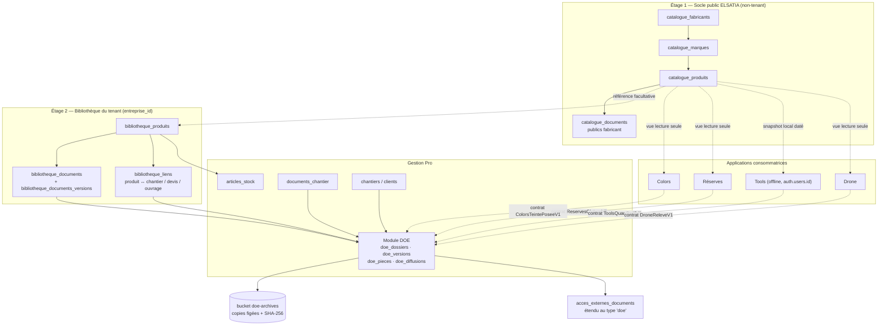

# ELSATIA — DOE ET BIBLIOTHÈQUE TECHNIQUE : AUDIT D'ARCHITECTURE V1

**Nature** : audit d'architecture, lecture seule.
**Date** : 2026-09-07.
**Aucun module développé, aucune migration créée, aucune fusion, aucun déploiement, aucun accès Supabase distant.**
Seul fichier écrit par ce lot : le présent document.

---

## 1. Verdict architectural

**GO ARCHITECTURE — option C (hybride), avec un référentiel canonique à deux étages et le DOE construit comme module de Gestion Pro, pas comme application.**

Trois constats commandent ce verdict, et chacun est vérifié dans le code :

1. **Le DOE existe déjà, à moitié.** `public.doe_generations`, la permission `gerer_doe`, l'écran `/chantiers/[id]/doe`, l'action `genererDoeAction` et la page d'impression `/imprimer/doe/[id]` sont livrés depuis la migration `20260717000096`. Ce qui manque n'est pas le module : c'est le **figement réel** (le manifeste ne fige que des identifiants, pas du contenu), l'export consolidé, et la transmission. Il ne faut donc pas concevoir un DOE, il faut **fermer celui qui existe**.
2. **La bibliothèque technique n'existe nulle part, mais son patron documentaire existe déjà et il est excellent.** `documents_notes_frais` + `versions_documents_notes_frais` (empreinte SHA-256, rôle de fichier, statut antivirus, horodatage, chaîne de remplacement) + `politiques_conservation_notes_frais` + `legal_holds_notes_frais` constituent une GED de qualité probatoire — construite pour **un seul module**. La bibliothèque cible doit être **la généralisation de ce patron**, pas une invention nouvelle.
3. **Le référentiel produit est déjà dupliqué trois fois en texte libre**, sans qu'aucune application ne le sache (§5). C'est le risque que ce lot doit arrêter maintenant : chaque nouvelle application (Réserves, Drone) ajoute sa propre colonne `marque`/`fabricant`/`reference`.

Un référentiel **entièrement** central est rejeté (§6) parce qu'il casserait Tools, dont le locataire est `auth.users.id` et dont le mode de fonctionnement est hors-ligne. Des référentiels **entièrement** indépendants sont rejeté parce qu'ils gèleraient la duplication déjà constatée.

---

## 2. État réel de l'existant

### 2.1 Ce qui existe et vit

| Objet | Emplacement | État réel |
|---|---|---|
| `public.doe_generations` | mig `20260717000096` | **vivant**, jamais fermé fonctionnellement |
| permission `gerer_doe` | mig `20260717000096` | vivante, dérivée de `gerer_chantiers` |
| écran DOE | `src/app/(app)/chantiers/[id]/doe/page.tsx` | vivant |
| action de figement | `src/app/actions/doe.ts` | vivante |
| page d'impression DOE | `src/app/imprimer/doe/[id]/page.tsx` | vivante |
| `public.fiches_techniques_articles` | mig `20260717000096` | **vivant** — amorce réelle de bibliothèque documentaire produit |
| bucket `fiches-techniques` | idem, 20 Mo, PDF/PNG/JPEG/WEBP | vivant |
| `public.documents_chantier` + bucket `chantier-documents` | mig `20260710000022` | vivant (plans, photos, PV, pièces techniques) |
| `public.acces_externes_documents` | mig `20260812000200` | **vivant** — partage externe par jeton, hash SHA-256 seul persisté, `expire_le`, `revoque_le` |
| `factures.entreprise_snapshot` | mig `20260812000200` | vivant — patron de snapshot documentaire |
| `public.signatures_documents` | mig `20260718000102` | vivant — `document_sha256`, `signature_sha256` |
| GED notes de frais (5 tables) | mig `20260713000057/58` | vivant — **patron documentaire de référence du dépôt** |
| `public.journal_activite` | mig `20260715000080` | vivant — journal générique (`action`, `ressource`, `ressource_id`, `metadata`) |

### 2.2 Ce qui n'existe pas — et qu'il ne faut pas supposer

Vérifié sur les 263 migrations du ledger courant : **aucune** table `fabricants`, `marques`, `produits`, `produits_techniques`, `bibliotheque_*`, `documents_techniques`, `certifications`, `doe_documents`, `doe_versions`, `doe_destinataires`, `catalogue_produits`. Aucun index de recherche plein-texte hors `colors_seaux`. Aucun antivirus réel branché nulle part (le seul point prévu, `analyse_antivirus_obligatoire` sur les notes de frais, renvoie explicitement 503 s'il est activé).

### 2.3 Les cinq limites réelles du DOE actuel

Lues dans `src/app/actions/doe.ts` :

1. **Le figement est nominal, pas réel.** `manifeste jsonb` stocke des *identifiants* (`documents: [{id, nom, categorie}]`, `fiches_techniques: [{id, …}]`). Si un document de chantier est supprimé ou remplacé après le figement, la version « figée » pointe dans le vide. Rien n'est copié, rien n'est haché.
2. **Les produits posés sont déduits, pas déclarés.** La liste vient de `mouvements_stock` de type `sortie` rattachés au chantier. Une entreprise qui n'utilise pas le module stock produit un DOE sans aucun produit ; une sortie de stock corrigée réécrit rétroactivement le DOE.
3. **Aucune sortie consolidée.** `/imprimer/doe/[id]` imprime un écran ; il n'existe ni PDF unique, ni ZIP structuré, ni pièce jointe.
4. **Aucune transmission.** `statut in ('genere','transmis','archive')` existe, mais aucune transition ni destinataire n'est implémenté. `acces_externes_documents` est limité à `type_document in ('devis','facture')` — le DOE ne peut pas s'y brancher aujourd'hui.
5. **Aucun snapshot client.** Le bloc d'identification lit `clients` en direct, exactement le P0 déjà établi par l'audit du modèle client (`ELSATIA_CANONICAL_CLIENT_MODEL_AND_SEARCH_AUDIT_V1.md` §8). Un DOE réimprimé deux ans plus tard n'affichera pas le même maître d'ouvrage.

Point positif à ne pas défaire : les policies `anon` de prototype ont bien été supprimées (`20260724000156`), et `DELETE` est révoqué sur `doe_generations` pour `authenticated` et `service_role` (`20260902000255:645-649`). La table est **déjà append-only de fait**.

---

## 3. Dépôts, branches et SHA inspectés

Dépôt unique : `git@github.com:julien-gregurec/Appli_BTP.git` (`elsatia-main`). Il n'existe **pas** de second dépôt applicatif : le seul autre dépôt de l'écosystème est celui du site vitrine (`elsatia-site`), hors périmètre de cet audit.

| Branche | SHA | Ledger migrations | Lu pour |
|---|---|---|---|
| `audit/cutover-operator-readiness-v1` (worktree courant) | `a083c37bdd74a8da9aa80ff2d5795905da0fd86e` | **265** (`…0265_essai_30_jours_modules_catalogue_v1.sql`, 263 fichiers) | DOE, stock, documents, partage externe, GED notes de frais |
| `integration/gp-postcutover-precommercial-ops-v1` | `4266ba6` | 267 | référence GP citée par l'audit modèle client |
| `feat/reserves-v3-collaboration-livrables` | `41c1a5f1ccdd0b610e472007bd08bf1099c8fb0f` | 268 → 270 | plans, photos, PDF de réserves |
| `feat/drone-core-contracts-v1` | `8dcf5b8c57116ba76ee908b8b339d58c861db18e` | aucune migration | contrats TS `drone-core` |
| `feat/colors-product-activity-history-v1` | `74002c214be0bb15936d1c35b22995b1fe32c766` | base **229** + `…0271` | traçabilité produit Colors |
| `integration/tools-tracing-v1` / `integration/tools-atelier-foundation-v1` | `db3e5b0` / `ecbe019` | — | exports Tools, atelier |

**Alerte ledger (nouvelle, non signalée ailleurs)** : la branche Colors `feat/colors-product-activity-history-v1` ne contient que **229 fichiers de migration** (elle s'arrête à `…0249`) et ajoute par-dessus `20260908000271_colors_activity_history_v14.sql`. Elle numérote donc à 271 depuis une base à 249, en sautant 250→267 qu'elle ne contient pas. Réserves numérote 268→270 depuis 267. Trois branches numérotent au-dessus de trois bases différentes. Ce n'est pas encore une collision (les numéros restent distincts), mais **l'ordre d'application réel ne correspond plus à l'ordre des numéros** — un objet créé en 265 peut être référencé par une migration 271 écrite sans le voir. À traiter avant tout lot bibliothèque, qui touchera par construction plusieurs applications.

### Documents d'architecture existants, et leur canonicité

| Document | Statut retenu ici |
|---|---|
| `docs/audits/ELSATIA_CANONICAL_CLIENT_MODEL_AND_SEARCH_AUDIT_V1.md` (2026-09-07) | **canonique** pour le modèle client, les snapshots documentaires et la recherche. Ses §8, §26 et §27 sont repris ici sans les recontester. |
| `docs/organisation/PIECES_JOINTES_V1.md` | **canonique** pour l'inventaire Storage et la classification par module. Sa §5 (« aucun composant d'upload générique n'existe ») est le point de départ de la §15 du présent rapport. |
| `docs/audits/ELSATIA_RESERVES_GP_INTEGRATION_READINESS_AUDIT_V1.md` | canonique pour le socle multi-app ; **son SHA de référence (`7b18d9b`, ledger 263) est antérieur** au ledger courant — relu, pas cité comme état présent. |
| `docs/architecture/ELSATIA_MULTI_APP_CONVERGENCE_V1.md` + `ELSATIA_COMMON_ACCOUNT_CONTRACT_V1.md` | canoniques pour `applications_elsatia`, `acces_applications_entreprises`, `habilitations_applications_utilisateurs`, `entitlements_utilisateurs_elsatia`. |
| `docs/drone/ELSATIA_DRONE_DATA_MODEL_V1.md` + `packages/drone-core` | canoniques pour Drone ; **contrats TypeScript uniquement, aucune persistance** — Drone ne peut donc rien imposer au schéma aujourd'hui. |
| `PIECES_JOINTES_V1.md` §3, ligne « Appels d'offres / DOE — classification E — DISABLED » | **périmé de fait.** Cette ligne dit « fiches techniques déjà couvertes par le module stock », ce qui est exact pour les *pièces jointes* mais ne dit rien du DOE lui-même, qui est vivant et exposé. À ne pas lire comme une décision d'abandon du DOE. |

---

## 4. Cartographie des modèles existants

### 4.1 Produit / article / matériau

| Table | Portée | Champs pertinents | Manques structurants |
|---|---|---|---|
| `articles_stock` | `entreprise_id` | `reference` (unique/entreprise), `designation`, `unite`, `marque`, `code_barres`, `prix_achat_ht`, `emplacement`, `zone_id`, `actif` | pas de fabricant distinct de la marque, pas de fournisseur, pas de catégorie, pas de version, pas d'obsolescence ni de remplacement, pas de dimensions ni de caractéristiques |
| `article_teintes` | `entreprise_id` + `article_id` | `nom`, `reference`, `code_hex`, `actif` | teinte liée à un article de stock uniquement ; aucun lien avec Colors |
| `prestations_catalogue` | `entreprise_id` | `designation`, `type` (`main_oeuvre`/`fourniture`/…), `unite`, `prix_unitaire_ht`, `taux_tva` | ouvrage/prestation, **pas** un produit |
| `boutique_produits` | **global, non-tenant** | `sku` (unique global), `nom`, `categorie`, `prix_ht`, `stock_disponible` | catalogue de matériel ELSATIA vendu aux clients — **précédent utile : une table produit globale existe déjà et fonctionne** |
| `colors_seaux` | `entreprise_id` | `marque`, `produit`, `reference_produit`, `teinte_nom`, `teinte_reference`, `couleur_hex`, `ral_approxime` + index GIN plein-texte | référentiel produit **entièrement en texte libre**, aucun lien vers `articles_stock` |
| `tarifs_fournisseurs` | `entreprise_id` | (table vivante, ACL réconciliées en `…0255`) | tarifs, pas identité produit |

### 4.2 Document et fichier

| Mécanisme | Bucket | Versionnement | Empreinte | Conservation |
|---|---|---|---|---|
| `documents_notes_frais` + `versions_documents_notes_frais` | `notes-frais`, `notes-frais-exports` | **oui** (`numero_version`, `numero_page`, `role_fichier` ∈ original/consultation/archive_figee/ocr_source) | **oui** (`empreinte_sha256`, chaînée) | **oui** (`politiques_conservation_notes_frais`, `legal_holds_notes_frais`) |
| `fiches_techniques_articles` | `fiches-techniques` | non (`version text` libre, non contraint) | **non** | non |
| `documents_chantier` | `chantier-documents` | non | non | non |
| `pieces_jointes_devis` | `devis-medias` | non | non | non |
| `pieces_jointes_messages` | `messagerie-medias` | non | non | non (immuables par conception) |
| `pieces_jointes_paie`, `bulletins_paie` | `documents-paie`, `bulletins-paie` | non | non | non |
| `reserves_photos`, `reserves_plans` (branche) | `reserves-photos`, `reserves-plans` | non | non | non |
| Drone (contrats seuls) | `drone-medias`, `drone-resultats`, `drone-exports`, `drone-partage` (**non créés**) | prévu par `provenance.ts` | prévu | non |

Buckets réellement créés au ledger 265 : `entreprise-assets` (seul public), `chantier-documents`, `devis-medias`, `messagerie-medias`, `documents-employes`, `factures-fournisseurs`, `fiches-techniques`, `notes-frais`, `notes-frais-exports`, `bulletins-paie`, `documents-paie`, `pointage-preuves`, `colors-seaux`. Convention universelle et respectée : **premier segment du chemin = `entreprise_id`**, validé par les policies `storage.objects` via `storage.foldername(name)[1]`. Réserves durcit la règle à un triplet `entreprise/chantier/reserve` vérifié en base ; Drone la reprend explicitement dans `buildStoragePath()`.

### 4.3 Locataire par application — la contrainte n° 1

| Application | Locataire | Persistance | Hors-ligne |
|---|---|---|---|
| Gestion Pro | `entreprises.id` | Postgres/RLS | non |
| Colors | `entreprises.id` | Postgres/RLS | non |
| Réserves | `entreprises.id` (+ `chantier_gp_id`) | Postgres/RLS | prévu |
| Drone | `entreprise_id` (type TS) | **aucune** | prévu |
| **Tools** | **`auth.users.id`** (+ `organization_id` nullable) | IndexedDB + `tools_projects` | **oui, par conception** |

C'est le fait qui interdit l'option A telle quelle : une bibliothèque dont l'accès serait uniquement `est_membre_actif(entreprise_id)` est **inaccessible à Tools**, dont la majorité des utilisateurs n'ont pas d'entreprise.

---

## 5. Risques de duplication

| # | Duplication | Preuve | Gravité |
|---|---|---|---|
| D1 | **Fabricant/marque en texte libre, 3 fois** | `articles_stock.marque`, `fiches_techniques_articles.fabricant`, `colors_seaux.marque` | **P0** — aucune jointure possible, aucune correction globale |
| D2 | **Référence produit en texte libre, 3 fois** | `articles_stock.reference`, `fiches_techniques_articles.reference_fabricant`, `colors_seaux.reference_produit` | **P0** |
| D3 | **Deux référentiels de teinte non reliés** | `article_teintes` (GP) et `colors_seaux.teinte_*` (Colors) | **P1** — Colors ne peut pas alimenter le DOE |
| D4 | **Sept implémentations d'upload sans noyau commun** | `PIECES_JOINTES_V1.md` §5, confirmé : `devis-medias.ts` et `messagerie-medias.ts` sont quasi identiques | **P1** — chaque nouvelle app en ajoute une |
| D5 | **Deux pipelines pour les photos de chantier** | `documents_chantier` et `pieces_jointes_messages` alimentent la même page | P2 (dette connue, assumée) |
| D6 | **Une GED probatoire pour un seul module** | notes de frais seulement ; ni le DOE, ni les fiches techniques n'y ont accès | **P0 pour le DOE** |
| D7 | **Le DOE recalcule ce qui devrait être figé** | `genererDoeAction` relit `documents_chantier` et `mouvements_stock` à chaque génération | **P0** |

Le point de bascule est proche : Réserves ajoute deux buckets et deux modèles de fichier, Drone en prévoit quatre. Sans décision maintenant, **treize buckets deviennent dix-neuf et sept modèles de pièce jointe en deviennent onze**, sans aucune table commune.

---

## 6. Options A / B / C comparées

**A — Référentiel central unique**, une seule bibliothèque, toutes les applications écrivent dedans.
**B — Référentiels indépendants** par application, reliés par contrats d'échange.
**C — Hybride** : référentiel canonique central en écriture contrôlée, **projections/caches en lecture** dans les applications qui en ont besoin.

| Critère | A — central | B — indépendants | C — hybride |
|---|---|---|---|
| Autonomie des applications | faible | maximale | **bonne** (lecture seule, dégradation gracieuse) |
| Disponibilité | point unique de panne | maximale | bonne (la projection survit à l'indisponibilité du socle) |
| Couplage | fort (schéma partagé) | nul, mais **duplication garantie** | modéré, unidirectionnel |
| Sécurité | une seule surface à durcir | *n* surfaces à durcir | une surface d'écriture + *n* surfaces de lecture |
| Multi-tenant | **casse sur Tools** (`auth.users.id`) | trivial | **résolu** : socle public non-tenant + étage privé tenant |
| RLS | policies complexes multi-app | simples | **simples des deux côtés** (public = lecture pour tous authentifiés ; privé = `est_membre_actif`) |
| Performance | jointures cross-domaines | aucune | lecture locale, coût nul en chemin chaud |
| Hors-ligne | **impossible pour Tools** | natif | **natif** (la projection est le cache) |
| Coûts | faibles | élevés (n × maintenance) | moyens |
| Maintenance | centralisée | dispersée | centralisée pour le socle |
| Duplication | nulle | **maximale** | contrôlée et datée |
| Migration | big-bang risqué | aucune | **incrémentale** (§21) |
| Versionnement | central | incohérent | central, projeté avec `version` |
| Standalone | **incompatible** | natif | **compatible** (§18) |
| Droits du propriétaire global | simples | ingérables | simples (le socle est un objet de plateforme) |
| Suppression d'un tenant | risque de casser des références partagées | trivial | **propre** : le socle public ne contient aucune donnée de tenant |
| Portabilité / export RGPD | difficile (données mêlées) | facile | **facile** (les données du tenant restent dans son étage) |
| Évolutivité | ajouter une app = modifier le central | ajouter une app = tout réécrire | **ajouter une app = ajouter un lecteur** |

**A est éliminée** par deux faits non négociables : Tools n'a pas d'`entreprise_id` et fonctionne hors-ligne. **B est éliminée** parce qu'elle sanctifie D1–D3, déjà présents. **C est retenue.**

---

## 7. Architecture recommandée

### 7.1 Le référentiel canonique a deux étages, pas un

C'est le cœur de la recommandation, et c'est ce qui rend C viable.

**Étage 1 — socle public ELSATIA (`catalogue_*`), non-tenant.**
Fabricants, marques, produits publics, documents publics de fabricant. Écriture réservée à la plateforme (`est_plateforme_admin()`, patron déjà en place et éprouvé sur `boutique_produits`). Lecture ouverte à tout utilisateur authentifié, **sans condition d'appartenance à une entreprise** — c'est précisément ce qui rend le socle utilisable par Tools. Aucune donnée personnelle, aucune donnée de tenant : ce socle est exportable, cacheable, et **ne bloque jamais la suppression d'un tenant**.

**Étage 2 — bibliothèque du tenant (`bibliotheque_*`), scoping `entreprise_id`.**
Produits privés de l'entreprise, prix, références fournisseur, documents privés, rattachements chantier/devis/ouvrage. RLS `est_membre_actif()` + `a_permission()`, exactement comme le reste de Gestion Pro. Un produit du tenant peut **référencer** un produit du socle (`catalogue_produit_id` nullable) ou vivre seul.

**Étage 3 (dérivé, pas stocké) — projections applicatives.**
Colors, Réserves, Tools et Drone ne lisent jamais les tables directement : ils consomment des **vues de lecture et des RPC `security definer`** exposant un contrat stable (§17). Tools en fait un **snapshot local** dans IndexedDB, daté et versionné — c'est le cache dont dépend son mode hors-ligne.

### 7.2 Le DOE est un module de Gestion Pro, pas une application

Tout ce que le DOE agrège vit déjà dans Gestion Pro : `chantiers`, `clients`, `documents_chantier`, `mouvements_stock`, `fiches_techniques_articles`, `entreprises`. Réserves lui apporte la liste finale des réserves *via un contrat*, comme Colors lui apporte les teintes. En faire une application séparée obligerait à répliquer le chantier et le client — exactement l'erreur que ce lot doit éviter.

### 7.3 Le DOE fige par copie, pas par référence

Règle non négociable, dérivée du patron `versions_documents_notes_frais` : **au figement, chaque pièce est copiée dans un bucket dédié `doe-archives`, hachée en SHA-256, et la version stocke le hash.** Le DOE ne pointe plus jamais vers un document vivant. C'est ce qui rend un DOE opposable deux ans plus tard, et c'est ce qui manque aujourd'hui (§2.3-1).

---

## 8. Diagramme des composants



Sens de lecture : **les flèches pleines sont des dépendances de schéma, les pointillées sont des contrats**. Aucune application consommatrice ne dépend du schéma d'une autre. Le DOE ne dépend d'aucune application : il reçoit des contrats.

---

## 9. Frontières de responsabilité

| Composant | Possède | Ne possède jamais |
|---|---|---|
| **Socle `catalogue_*`** | l'identité publique d'un produit (fabricant, marque, référence fabricant, désignation, caractéristiques, certifications publiques, cycle de vie/remplacement) | prix, stock, rattachement chantier, donnée de tenant |
| **Bibliothèque `bibliotheque_*`** | le produit tel que *cette* entreprise le connaît (référence fournisseur, prix, documents privés, liens) | l'identité publique (elle la référence) |
| **Gestion Pro / stock** | la quantité, le mouvement, le prix d'achat | l'identité produit (il la référence) |
| **Module DOE** | le dossier, ses versions figées, ses pièces copiées, ses diffusions | les documents vivants (il en prend copie) |
| **Colors** | l'état physique des contenants et les teintes réellement présentes | l'identité du produit peinture (il la référence) |
| **Réserves** | les réserves, leur cycle de vie, leur clôture | le DOE (il lui fournit un contrat) |
| **Tools** | le calcul, la géométrie, le projet local | toute donnée de tenant (lecture seule, snapshot) |
| **Drone** | le relevé, la mesure, la provenance | le produit et le chantier (références externes) |

---

## 10. Modèle conceptuel de données

Nommage français, cohérent avec le dépôt. Contraintes exprimées en intention — **aucune migration n'est écrite ici**.

### 10.1 Socle public

```
catalogue_fabricants
  id, code (unique, slug), nom, pays, site_web, actif,
  created_at, updated_at

catalogue_marques
  id, fabricant_id → catalogue_fabricants, nom, actif
  unique (fabricant_id, nom)

catalogue_produits
  id, marque_id → catalogue_marques, fabricant_id (dénormalisé, cohérence vérifiée)
  reference_fabricant, designation, description,
  categorie, sous_categorie, unite,
  couleur, finition,
  dimensions jsonb, caracteristiques jsonb, certifications jsonb,
  date_validite_debut, date_validite_fin,
  version_fiche text,
  statut ∈ ('actif','obsolete','retire'),
  remplace_par_id → catalogue_produits (nullable, jamais cyclique),
  publie boolean,
  created_at, updated_at
  unique (marque_id, reference_fabricant)

catalogue_documents
  id, produit_id → catalogue_produits,
  type_document ∈ ('fiche_technique','notice_pose','fiche_securite','certification',
                   'proces_verbal','declaration_performance','documentation_fabricant',
                   'photo','plan','garantie','libre'),
  titre, langue, version, date_emission, date_validite_fin,
  storage_bucket, storage_path,
  empreinte_sha256, mime_type, taille_octets,
  source ∈ ('import_plateforme','site_fabricant','fournisseur'), source_url,
  statut ∈ ('actif','remplace','retire'), remplace_par_id,
  created_at
  unique (produit_id, type_document, version, empreinte_sha256)   ← clé de déduplication §15
```

### 10.2 Bibliothèque du tenant

```
bibliotheque_produits
  id, entreprise_id,
  catalogue_produit_id (nullable) → catalogue_produits,
  -- si catalogue_produit_id est nul, les champs d'identité sont saisis localement :
  fabricant_libelle, marque_libelle, reference_fabricant, designation, description,
  categorie, sous_categorie, unite, couleur, finition,
  dimensions jsonb, caracteristiques jsonb,
  fournisseur_id → fournisseurs (nullable), reference_fournisseur,
  article_stock_id → articles_stock (nullable, 1:1 souple),
  statut ∈ ('actif','obsolete'), remplace_par_id,
  created_at, updated_at, created_by
  unique (entreprise_id, catalogue_produit_id) where catalogue_produit_id is not null
  unique (entreprise_id, fabricant_libelle, reference_fabricant) where catalogue_produit_id is null

bibliotheque_documents
  id, entreprise_id, produit_id → bibliotheque_produits (nullable),
  chantier_id (nullable), type_document (même énumération que le socle),
  titre, visibilite ∈ ('privee','partageable'),
  proprietaire_utilisateur_id, statut ∈ ('actif','archive','remplace'),
  archive_at, created_at, created_by

bibliotheque_documents_versions          ← calque de versions_documents_notes_frais
  id, entreprise_id, document_id, numero_version,
  role_fichier ∈ ('original','consultation','archive_figee'),
  storage_bucket, storage_path, nom_fichier_original,
  mime_type_declare, mime_type_detecte, taille_octets,
  empreinte_sha256, antivirus_statut, horodatage_provider, horodatage_reference,
  created_by, created_at
  unique (document_id, numero_version, role_fichier)
  unique (storage_path)

bibliotheque_liens
  id, entreprise_id, produit_id,
  cible_type ∈ ('chantier','devis','ligne_devis','ouvrage','reserve','seau_colors'),
  cible_id, quantite, unite, pose_at, created_at
```

### 10.3 DOE

```
doe_dossiers
  id, entreprise_id, chantier_id,
  titre, statut ∈ ('brouillon','fige','transmis','revise','archive'),
  created_at, created_by

doe_versions                                   ← append-only, DELETE révoqué
  id, entreprise_id, dossier_id, numero_version,
  fige_at, fige_par,
  client_snapshot jsonb   NOT NULL,            ← ferme le P0 §2.3-5
  entreprise_snapshot jsonb NOT NULL,
  chantier_snapshot jsonb NOT NULL,
  intervenants_snapshot jsonb,
  reserves_snapshot jsonb,                     ← reçu de Réserves par contrat
  sommaire jsonb,
  empreinte_globale_sha256,                    ← hash de l'ensemble ordonné des pièces
  pdf_storage_path, zip_storage_path,
  unique (dossier_id, numero_version)

doe_pieces                                     ← une ligne par pièce COPIÉE
  id, entreprise_id, version_id, ordre, section,
  origine_type ∈ ('document_chantier','bibliotheque_document','catalogue_document',
                  'reserve_photo','drone_export','tools_export','genere'),
  origine_id,                                   ← traçabilité, jamais une dépendance de lecture
  titre, type_document,
  storage_bucket = 'doe-archives', storage_path,
  empreinte_sha256, mime_type, taille_octets,
  created_at
  unique (version_id, empreinte_sha256)        ← déduplication intra-DOE

doe_diffusions
  id, entreprise_id, version_id,
  canal ∈ ('telechargement','lien','email'),
  destinataire_snapshot jsonb,
  acces_externe_id → acces_externes_documents (nullable),
  envoye_at, envoye_par, revoque_at,
  created_at

doe_telechargements                            ← append-only
  id, entreprise_id, diffusion_id,
  telecharge_at, ip_tronquee, user_agent_tronque
```

---

## 11. Rôles et permissions

Aucune permission nouvelle n'est nécessaire côté DOE : **`gerer_doe` existe déjà** et est dérivée de `gerer_chantiers`. Trois permissions sont à ajouter pour la bibliothèque, sur le patron `permissions_disponibles` + dérivation `permissions_poste` déjà utilisé par `20260717000096` :

| Clé | Module | Dérivée de | Portée |
|---|---|---|---|
| `acces_bibliotheque` | Bibliothèque | `acces_stock` **et** `acces_chantiers` | lire produits et documents du tenant |
| `gerer_bibliotheque` | Bibliothèque | `gerer_stock` | créer/modifier/archiver produits et documents |
| `diffuser_doe` | Chantiers | `gerer_doe` | émettre un lien externe, envoyer par email, révoquer |

Séparer `diffuser_doe` de `gerer_doe` est délibéré : figer un dossier est un acte interne, l'envoyer à un maître d'ouvrage est un acte externe et irréversible. Le dépôt fait déjà cette distinction pour les devis et factures (`gerer_devis` gouverne l'émission d'un lien externe, policy `ecriture acces externes selon permission`).

Rôles applicatifs multi-app : le socle `catalogue_*` s'administre depuis la plateforme (`est_plateforme_admin()`), avec les mêmes exigences AAL2 que les autres mutations de plateforme (`20260826000237_platform_aal2_role_integrity_v1.sql`). **Aucun tenant n'écrit dans le socle.**

Matrice de lecture du socle : tout utilisateur `authenticated`, y compris un utilisateur Tools sans entreprise. C'est la seule policy de l'écosystème qui ne passe pas par `est_membre_actif()` — c'est volontaire, documenté ici, et sans risque parce que le socle ne contient aucune donnée de tenant.

---

## 12. Versionnement documentaire

Le patron est déjà écrit dans le dépôt : `versions_documents_notes_frais`. Il est repris tel quel, avec ses quatre garanties :

1. **Un document est une identité, une version est un fichier.** `bibliotheque_documents` porte le sens (type, produit, visibilité) ; `bibliotheque_documents_versions` porte les octets.
2. **Chaque version porte son empreinte** `empreinte_sha256` (contrainte `~ '^[0-9a-f]{64}$'`, comme l'existant).
3. **Les rôles de fichier sont explicites** : `original` (ce qui a été téléversé, jamais modifié), `consultation` (dérivé, ex. PDF normalisé), `archive_figee` (la copie servant de preuve).
4. **Le remplacement est une chaîne, pas un écrasement** : `statut = 'remplace'` + `remplace_par_id`, jamais un `UPDATE` du chemin de stockage.

Pour le DOE, le versionnement est plus strict encore : `doe_versions` est **append-only** (révoquer `DELETE` et `UPDATE` sauf sur les colonnes de diffusion), comme `doe_generations` l'est déjà de fait (`20260902000255:645-649`). Une révision produit une version *n+1*, jamais une modification de *n*.

Numérotation : `numero_version` entier, monotone par dossier, attribué en base (trigger), jamais côté application — patron `trg_devis_numero`/`trg_facture_numero`.

---

## 13. Stratégie de stockage

**Trois buckets nouveaux, pas plus.**

| Bucket | Public | Taille max | Contenu | Convention de chemin |
|---|---|---|---|---|
| `catalogue-documents` | **non** | 30 Mo | documents publics fabricant (socle) | `catalogue/<produit_id>/<uuid>-<nom>` |
| `bibliotheque-documents` | non | 30 Mo | documents privés du tenant | `<entreprise_id>/<produit_id>/<uuid>-<nom>` |
| `doe-archives` | non | 50 Mo | copies figées des pièces d'un DOE | `<entreprise_id>/<chantier_id>/<version_id>/<uuid>-<nom>` |

`catalogue-documents` est le seul bucket de l'écosystème dont le premier segment n'est pas un `entreprise_id` — parce qu'il n'appartient à aucun tenant. Le littéral `catalogue/` en tête est délibéré : il rend la policy triviale (`storage.foldername(name)[1] = 'catalogue'` ⇒ lecture pour tout `authenticated`, écriture pour `est_plateforme_admin()` seul) et **empêche qu'un chemin de tenant y soit confondu**.

`bibliotheque-documents` et `doe-archives` respectent strictement la convention en vigueur (`entreprise_id` en premier segment). `doe-archives` durcit comme Réserves : la policy doit vérifier que le triplet `entreprise/chantier/version` décrit une version réelle, pas seulement que l'UUID de tête est celui du membre.

**MIME** : liste blanche par bucket, comme l'existant (`application/pdf`, `image/png`, `image/jpeg`, `image/webp`, plus `application/zip` pour les exports DOE). Vérification des *magic bytes* côté serveur obligatoire — le patron existe (`detecterMimeMediaX`/`mimeDetecteCompatible` dans `devis-medias.ts` et `messagerie-medias.ts`), et c'est ici, avec un troisième et un quatrième consommateur, que la §5 de `PIECES_JOINTES_V1.md` déclare le moment venu d'extraire le noyau commun (**P1-3**, §22).

**Orphelins** : flux `préparer → upload → finaliser` avec nettoyage du fichier Storage si l'insertion échoue — patron déjà appliqué partout dans le dépôt, à ne pas réinventer.

---

## 14. Stratégie de recherche

Un seul précédent existe et il est bon : l'index GIN de `colors_seaux` (`20260828000246:130-134`), `to_tsvector('simple', …)` sur la concaténation des champs d'identité. `simple` (et non `french`) est le bon choix pour des références techniques — pas de racinisation sur `BA13` ou `RAL 7016`.

Cible :

- `catalogue_produits` : index GIN sur `fabricant ‖ marque ‖ reference_fabricant ‖ designation ‖ categorie ‖ couleur ‖ finition`.
- `bibliotheque_produits` : même index, plus `reference_fournisseur`.
- `bibliotheque_documents` : index GIN sur `titre ‖ type_document`, joint au produit.
- **Normalisation** : minuscules, suppression des accents (`unaccent`), suppression des séparateurs dans les références (`BA-13`, `BA 13`, `BA13` doivent converger) — via une colonne générée `reference_normalisee`, indexée `btree`, en plus du GIN.
- **Multi-termes** : `websearch_to_tsquery` avec `AND` implicite, seuil de pertinence, `LIMIT` strict.
- **Seuils** : l'audit modèle client (§14) a déjà posé les seuils de performance attendus pour la recherche universelle ; la bibliothèque s'y aligne plutôt que d'en définir d'autres.

La recherche du socle et celle du tenant sont **deux requêtes distinctes fusionnées côté application**, jamais un `UNION` en base : cela garde les policies simples et rend la dégradation gracieuse si le socle est indisponible.

---

## 15. Stratégie de déduplication

Deux niveaux, deux clés différentes — c'est le point où une erreur de conception coûterait cher.

**Niveau identité produit** — clé métier : `(marque_id, reference_fabricant)` normalisée. Un produit n'est jamais dédupliqué sur sa désignation (le même produit est nommé différemment par chaque fournisseur). En cas de conflit à l'import, **on ne fusionne pas silencieusement** : on crée une proposition de rapprochement à valider (patron `suggestions_ocr_notes_frais`, qui fait exactement cela pour l'OCR).

**Niveau fichier** — clé technique : `empreinte_sha256`. Trois usages :

1. `unique (produit_id, type_document, version, empreinte_sha256)` sur `catalogue_documents` : le même PDF ne peut pas être importé deux fois pour la même version.
2. `unique (version_id, empreinte_sha256)` sur `doe_pieces` : la même fiche technique référencée par trois produits n'apparaît **qu'une fois** dans le DOE.
3. À l'échelle du bucket, l'empreinte permet un **stockage par contenu** : si un tenant téléverse un fichier déjà présent dans le socle avec le même hash, on référence au lieu de copier — sauf pour `doe-archives`, où la copie est le but (une preuve ne doit pas dépendre d'un fichier partagé).

**Ce qu'il ne faut pas faire** : dédupliquer sur `(fabricant_texte, reference_texte)` avant d'avoir normalisé. Les trois sources actuelles (D1/D2) contiennent la même marque écrite de trois façons ; une déduplication naïve fusionnerait des produits différents.

---

## 16. Stratégie DOE

### 16.1 Cycle de vie

```
brouillon ──figer──> fige ──diffuser──> transmis ──reviser──> (nouvelle version: brouillon)
     │                  │                    │
     └──────────────────┴────────────────────┴──> archive
```

`fige` est irréversible. Une révision ne modifie jamais une version figée : elle crée la version *n+1*. `archive` n'efface rien.

### 16.2 Ce que le figement fait, exactement

1. Résout le contenu (documents de chantier, produits posés, fiches techniques, plans, photos, PV, garanties, réserves).
2. **Copie** chaque pièce dans `doe-archives`, calcule son SHA-256, écrit une ligne `doe_pieces`.
3. Écrit les snapshots `client_snapshot`, `entreprise_snapshot`, `chantier_snapshot`, `intervenants_snapshot`, `reserves_snapshot`.
4. Calcule `empreinte_globale_sha256` sur la liste ordonnée `(ordre, titre, empreinte_sha256)` — c'est l'empreinte opposable du dossier.
5. Génère le sommaire et l'index, puis le **PDF consolidé** et le **ZIP structuré**.
6. Ne touche à rien d'autre. Aucun document vivant n'est modifié.

### 16.3 Produits réellement posés

Le déduire des sorties de stock (comportement actuel) est conservé **comme suggestion**, jamais comme vérité. La source de vérité devient `bibliotheque_liens` (`cible_type = 'chantier'`), alimentée par : les sorties de stock, les lignes de devis réalisées, Colors (`ColorsTeintePoseeV1`), et la saisie manuelle. L'écran de figement affiche la liste proposée et **exige une validation explicite** — un DOE est une déclaration de l'entreprise, pas un calcul.

### 16.4 Réserves

Deux modes, choisis au figement : *liste finale des réserves* (toutes, avec leur statut) ou *preuve de clôture* (attestation que toutes sont levées, avec le décompte et la date de la dernière levée). Les deux proviennent du même contrat `ReservesClotureV1` (§17) et sont figés dans `reserves_snapshot`. Si Réserves n'est pas déployé pour ce tenant, la section est simplement absente — **le DOE ne dépend pas de Réserves**.

### 16.5 Exports et diffusion

| Sortie | Mécanisme | Existant réutilisé |
|---|---|---|
| PDF consolidé | Chromium serveur naviguant la page réelle | pipeline P9 (`@sparticuz/chromium`), déjà en production |
| ZIP structuré | `01_Sommaire/`, `02_Plans/`, `03_Produits/<fabricant>/`, `04_PV/`, `05_Photos/`, `06_Reserves/`, `07_Garanties/` | patron `exports_notes_frais` (bucket 250 Mo) |
| Téléchargement | route authentifiée + URL signée courte | routes `/api/documents/*` |
| Lien sécurisé | **`acces_externes_documents` étendu à `type_document = 'doe'`** — jeton non séquentiel, seul le hash SHA-256 persisté, `expire_le`, `revoque_le` | mig `20260812000200`, déjà éprouvé en production |
| Email | Brevo, pièce jointe + HTML | module Brevo P9 |
| Portail client | **hors périmètre** — la table `doe_diffusions` le rend possible sans refonte | — |

**Durée de validité par défaut** : 90 jours pour un lien DOE (contre l'usage plus court des devis/factures), justifiée par le fait qu'un DOE est consulté longtemps après sa remise. Révocation immédiate par `revoque_le`. **Audit des téléchargements** : `doe_telechargements`, append-only, IP tronquée et user-agent tronqué (minimisation RGPD).

### 16.6 Signature

**Non développée.** Le point d'ancrage existe (`signatures_documents`, `document_sha256`) et `empreinte_globale_sha256` est précisément la valeur qu'il faudra signer. Une réserve à consigner : l'audit modèle client (§8.2-3) a établi que `serialiserDocumentStable` **n'inclut pas le bloc destinataire** — le DOE ne doit pas reproduire ce défaut : son empreinte couvre les snapshots, pas seulement les pièces.

### 16.7 Conservation

`politiques_conservation_notes_frais` est le patron ; le DOE relève d'une durée plus longue (garantie décennale, art. 1792 et 2270 du code civil : **10 ans à compter de la réception**). Recommandation : table `politiques_conservation_doe` par entreprise, défaut 10 ans, jamais de suppression automatique par défaut, et **legal hold possible** (patron `legal_holds_notes_frais`) — un DOE peut être une pièce de contentieux.

---

## 17. Contrats d'échange entre applications

Contrats TypeScript versionnés, dans un paquet partagé (`packages/elsatia-contracts`, sur le modèle de `packages/application-access` et `packages/drone-core`). **Une application peut ignorer un contrat sans casser** : tous les champs entrants sont optionnels côté DOE.

| Contrat | Producteur | Consommateur | Charge utile (essentiel) |
|---|---|---|---|
| `CatalogueProduitRefV1` | socle | toutes | `{ catalogue_produit_id, fabricant, marque, reference_fabricant, designation, unite, statut }` |
| `CatalogueDocumentRefV1` | socle | GP/DOE, Colors, Réserves | `{ document_id, type_document, titre, version, empreinte_sha256, url_signee_courte }` |
| `ColorsTeintePoseeV1` | Colors | GP/DOE | `{ chantier_ref, marque, produit, reference_produit, teinte_nom, teinte_reference, couleur_hex, ral_approxime, quantite, unite, pose_at }` |
| `ReservesClotureV1` | Réserves | GP/DOE | `{ chantier_gp_id, total, levees, restantes, cloture_at, reserves: [{ ref, localisation, statut, levee_at, photos: [empreinte] }] }` |
| `ToolsQuantitatifV1` | Tools | GP/DOE | `{ project_local_id, tool_id, ouvrage_type, quantites: [{ libelle, valeur, unite }], exports: [{ format, empreinte_sha256 }] }` |
| `DroneReleveV1` | Drone | GP/DOE | `{ project_id, mission_ref, mesures, orthophoto_ref, rapport_ref, degraded_source }` |
| `BibliothequeLienV1` | toutes | bibliothèque | `{ produit_ref, cible_type, cible_id, quantite, unite, pose_at }` |

Trois règles qui rendent ces contrats tenables :

1. **Aucune URL n'est persistée dans un contrat.** Seulement `(bucket, path)` ou une URL signée courte, jamais stockée — règle déjà écrite noir sur blanc dans `packages/drone-core/src/storage-ref.ts` et à généraliser.
2. **Le versionnement est dans le nom du type** (`…V1`), jamais dans un champ. Un `V2` coexiste avec `V1`.
3. **Le consommateur valide, le producteur ne suppose rien.** Un DOE reçoit `ReservesClotureV1` et vérifie que `chantier_gp_id` correspond au chantier ouvert ; il ne fait pas confiance à la charge utile.

---

## 18. Compatibilité standalone

| Application | Peut-elle fonctionner sans la bibliothèque ? | Comment |
|---|---|---|
| **Tools** | **oui, entièrement** | Le socle est consommé en **snapshot local daté** (IndexedDB), rafraîchi quand le réseau est là. Sans snapshot, Tools fonctionne exactement comme aujourd'hui : les références produit sont une aide facultative, jamais une entrée de calcul. Tools **n'écrit jamais** dans la bibliothèque. |
| **Colors** | oui | La bibliothèque enrichit `marque`/`produit`/`reference_produit` ; en son absence, la saisie libre actuelle reste valide. La colonne `catalogue_produit_id` est nullable. |
| **Réserves** | oui | Aucune dépendance produit. Elle ne consomme que `CatalogueDocumentRefV1`, facultatif. |
| **Drone** | oui | Sans persistance aujourd'hui ; ses contrats référencent le socle par identifiant, jamais par jointure. |
| **Gestion Pro / DOE** | oui, en mode dégradé | Un DOE peut être figé avec des produits saisis localement (`catalogue_produit_id` nul). Le socle améliore la qualité, il ne conditionne pas le figement. |

Principe général : **`catalogue_produit_id` est toujours nullable.** C'est la seule décision de schéma qui garantit qu'aucune application ne devient captive du socle.

---

## 19. Sécurité

| Sujet | Décision | Précédent réutilisé |
|---|---|---|
| Isolation multi-tenant | Étage 2 : `est_membre_actif()` + `a_permission()`, policies RESTRICTIVE en lecture **et** en écriture | correctif `20260824000224` (§2 de `PIECES_JOINTES_V1.md`) — ne pas répéter l'angle mort « RESTRICTIVE en écriture seulement » |
| Socle public | lecture `authenticated` sans condition de tenant ; écriture `est_plateforme_admin()` + AAL2 | `boutique_produits`, `20260826000237` |
| Partage externe | `acces_externes_documents` étendu ; **jeton jamais persisté en clair**, seul le SHA-256 | mig `20260812000200` |
| Durée des liens | 90 j pour un DOE, configurable, jamais illimitée | — |
| Révocation | `revoque_le` + résolution par fonction `security definer` qui refuse un jeton révoqué ou expiré | idem |
| URLs signées | 60 à 900 s selon le module, **jamais stockées en base** | règle en vigueur, vérifiée |
| Antivirus | **stub honnête** : `antivirus_statut` sur chaque version, valeur `non_configure` par défaut, et refus explicite (503) si une politique l'exige sans scanner branché | `analyse_antivirus_obligatoire` des notes de frais — **ne jamais afficher « sain » sans scanner réel** |
| Types MIME | liste blanche par bucket + vérification des magic bytes côté serveur | `devis-medias.ts`, `messagerie-medias.ts` |
| Taille max | 30 Mo (documents), 50 Mo (archives DOE) | cohérent avec l'existant (15–250 Mo) |
| Métadonnées | EXIF **conservés** sur les photos de chantier et de réserves ; jamais publiés dans un DOE diffusé à l'externe sans décision explicite | `drone-core/media.ts` §76 |
| Fichiers malveillants | nom de fichier jamais utilisé comme chemin ; `entreprise_id/…/uuid-nom-securise` ; normalisation Unicode | règle en vigueur |
| Chiffrement | au repos par l'hébergeur ; **pas de chiffrement applicatif** — il casserait la déduplication par empreinte et le scan antivirus, pour un gain nul face à la menace réelle | décision explicite |
| Journalisation | `journal_activite` pour les actes ordinaires ; tables append-only dédiées pour le figement et les diffusions | `journal_audit_notes_frais` |
| Données personnelles | un DOE contient l'identité du maître d'ouvrage : le `client_snapshot` est une **donnée personnelle figée volontairement**, à déclarer au registre RGPD, avec la base légale « exécution du contrat » et la durée de garantie décennale | `REGISTRE_TRAITEMENTS_RGPD.md` |
| Suppression de tenant | l'étage 2 tombe avec le tenant ; le socle est intact ; les DOE relèvent de la conservation comptable/décennale déjà implémentée pour la suppression de compte | RPC de suppression existante |
| Historique immuable | `doe_versions`, `doe_pieces`, `doe_telechargements` : `DELETE` et `UPDATE` révoqués | `doe_generations` l'est déjà (`…0255:645-649`) |

---

## 20. Sauvegarde et restauration

- **Base** : sauvegarde Supabase existante ; aucune exigence nouvelle.
- **Storage** : c'est le point faible réel. Les trois nouveaux buckets doivent entrer dans la procédure de sauvegarde Storage documentée pour le DR (volume chiffré `ELSATIA-PRODUCTION-DR`). Un DOE dont la base survit mais dont `doe-archives` est perdu **n'est plus une preuve** — l'empreinte reste, le contenu non.
- **Test de restauration** : critère d'acceptation P0-6 (§25) — restaurer une version de DOE et vérifier que **chaque** `empreinte_sha256` de `doe_pieces` correspond au fichier restauré. C'est le seul test qui prouve que l'archivage fonctionne.
- **Rétention** : sauvegardes datées conservées au moins aussi longtemps que la plus courte politique de conservation active (10 ans par défaut pour le DOE ⇒ la sauvegarde n'est pas le support d'archivage légal ; c'est le bucket qui l'est).

---

## 21. Plan de migration

Incrémental, sans big-bang, dans cet ordre. **Aucune de ces étapes n'est exécutée par ce lot.**

1. **Réconcilier le ledger** avant toute chose (§3, alerte). Une bibliothèque transverse écrite sur un ledger fragmenté produira des migrations non rejouables.
2. **Créer le socle vide** (`catalogue_*` + bucket). Aucun impact fonctionnel, aucune donnée déplacée.
3. **Créer l'étage tenant** (`bibliotheque_*` + bucket). Toujours aucun impact : rien ne l'alimente encore.
4. **Adosser l'existant sans le déplacer** : ajouter `bibliotheque_produit_id` (nullable) à `articles_stock`, et `bibliotheque_document_id` (nullable) à `fiches_techniques_articles`. **Aucune donnée n'est copiée**, aucune colonne n'est supprimée. Les deux modèles coexistent.
5. **Backfill assisté, jamais automatique** : un écran propose de rapprocher chaque `articles_stock` d'un produit du socle ; l'utilisateur valide. Les non-rapprochés deviennent des produits locaux (`catalogue_produit_id` nul).
6. **Fermer le DOE** : nouvelles tables `doe_*`, figement par copie, PDF/ZIP, diffusion. `doe_generations` est **conservée en lecture** (historique), marquée `legacy`, et l'écran affiche les anciennes générations comme telles. Aucune migration de données : les anciens « manifestes » n'ont pas de contenu à migrer.
7. **Brancher les consommateurs**, un par un, chacun derrière son contrat : Colors, puis Réserves, puis Tools (lecture seule), puis Drone.
8. **Ne jamais supprimer** `fiches_techniques_articles` tant que le nouveau modèle n'a pas un an de recul et une restauration testée.

---

## 22. Lots d'implémentation

### P0 — socle indispensable

| Lot | Contenu | Sortie |
|---|---|---|
| **P0-1** | Réconciliation du ledger de migrations (3 branches, 3 bases) | ledger unique rejouable |
| **P0-2** | Socle `catalogue_*` + bucket `catalogue-documents` + policies + pgTAP | schéma vide, testé |
| **P0-3** | Étage `bibliotheque_*` + versions + bucket + permissions `acces_/gerer_bibliotheque` | schéma vide, testé |
| **P0-4** | Noyau d'upload commun extrait (nom sécurisé, magic bytes, orphelins, empreinte) | `packages/elsatia-fichiers` |
| **P0-5** | DOE : `doe_dossiers/versions/pieces` + figement **par copie** + snapshots client/entreprise/chantier | DOE opposable |
| **P0-6** | Test de restauration Storage bout en bout (empreintes revérifiées) | preuve d'archivage |

### P1 — utilisable

| Lot | Contenu |
|---|---|
| **P1-1** | PDF consolidé + ZIP structuré du DOE |
| **P1-2** | Diffusion : `acces_externes_documents` étendu à `'doe'`, email Brevo, `doe_diffusions`, `doe_telechargements`, révocation |
| **P1-3** | Recherche (GIN + normalisation des références) sur socle et bibliothèque |
| **P1-4** | Écran de rapprochement `articles_stock` → bibliothèque (backfill assisté) |
| **P1-5** | Contrat `ReservesClotureV1` + section réserves du DOE |
| **P1-6** | Politique de conservation DOE + legal hold |

### P2 — enrichissement

| Lot | Contenu |
|---|---|
| **P2-1** | Contrat `ColorsTeintePoseeV1` (teintes réellement posées dans le DOE) |
| **P2-2** | Snapshot local du socle dans Tools (lecture seule, hors-ligne) |
| **P2-3** | Import fournisseur/fabricant en masse + propositions de rapprochement |
| **P2-4** | Contrat `DroneReleveV1` (quand Drone aura une persistance) |
| **P2-5** | Signature du DOE (sur `empreinte_globale_sha256`) |
| **P2-6** | Portail client |

---

## 23. Dépendances

```
P0-1 ──> P0-2 ──> P0-3 ──> P0-4 ──> P0-5 ──> P0-6
                    │                 │
                    └──> P1-3         ├──> P1-1 ──> P1-2
                    └──> P1-4         └──> P1-5, P1-6
P0-2 ──> P2-2, P2-3
P0-3 ──> P2-1
P1-1 ──> P2-5, P2-6
```

Dépendances **externes** au périmètre technique, mais bloquantes en pratique :

- **Le P0 du modèle client** (`client_snapshot` sur devis et factures, audit canonique §8) doit être traité **avant ou avec** P0-5 : le DOE réutilise exactement le même mécanisme de snapshot, et le construire deux fois différemment serait une faute.
- **Le lot ELSATIA-UI-V2** (refonte visuelle obligatoire avant commercialisation) : les écrans bibliothèque et DOE ne doivent pas être dessinés avant que ses directions soient gelées, sinon ils seront refaits.
- **Réserves** doit être déployée pour que P1-5 ait un producteur.
- **Drone** n'a aucune persistance : P2-4 est bloqué tant qu'aucune migration Drone n'existe.

---

## 24. Risques

| # | Risque | Probabilité | Impact | Atténuation |
|---|---|---|---|---|
| R1 | Le figement du DOE reste par référence « pour aller plus vite » | **élevée** | **critique** — DOE non opposable | critère d'acceptation A5 (§25) : test qui supprime le document source et revérifie l'empreinte |
| R2 | Backfill automatique des produits ⇒ fusions erronées | élevée | élevé, irréversible | jamais de fusion automatique (§15) ; propositions validées |
| R3 | Le socle devient un point de blocage pour Tools | moyenne | élevé | `catalogue_produit_id` toujours nullable ; snapshot local ; lecture sans `entreprise_id` |
| R4 | Ledger de migrations non réconcilié | **avérée** | élevé | P0-1 en premier |
| R5 | Multiplication des buckets (13 → 19+) | élevée | moyen | plafond de trois nouveaux buckets, décidé ici |
| R6 | `antivirus_statut` affiché « sain » sans scanner | moyenne | élevé (faux sentiment de sécurité) | valeur `non_configure` par défaut, 503 si exigé sans scanner |
| R7 | Un DOE diffusé fuit des EXIF de géolocalisation | moyenne | moyen (RGPD) | décision explicite au figement, EXIF conservés en interne, purgés à la diffusion externe |
| R8 | La chaîne d'empreintes ne couvre pas les snapshots | moyenne | élevé (mêmes défaut que §8.2-3 de l'audit client) | `empreinte_globale_sha256` inclut les snapshots |
| R9 | Perte du bucket `doe-archives` non détectée | faible | **critique** | P0-6, revérification périodique des empreintes |
| R10 | Sur-conception : construire une GED générique avant d'avoir un usage | moyenne | moyen (retard) | périmètre P0 volontairement limité à deux étages + DOE ; pas de workflow documentaire, pas d'OCR, pas de portail |
| R11 | `PIECES_JOINTES_V1.md` classait DOE en « DISABLED » | avérée | moyen (confusion) | corrigé ici (§3) : le DOE est vivant, la ligne visait les pièces jointes |

---

## 25. Critères d'acceptation

| # | Critère | Vérifiable par |
|---|---|---|
| A1 | Un produit du socle est lisible par un utilisateur **sans entreprise** (cas Tools) | pgTAP : session `authenticated` sans `utilisateurs_entreprises` |
| A2 | Un produit de la bibliothèque d'une entreprise est **invisible** depuis une autre entreprise | pgTAP cross-tenant, patron existant |
| A3 | Un membre sans `acces_bibliotheque` ne peut ni lire ni télécharger un document de bibliothèque, **y compris via l'API Storage directe** | pgTAP + test de policy `storage.objects` |
| A4 | Une version de DOE figée est **inaltérable** : `UPDATE` et `DELETE` refusés pour `authenticated` et `service_role` | pgTAP sur les ACL |
| A5 | **Supprimer un document de chantier après figement ne change pas le DOE** : la pièce copiée reste, son empreinte reste valide | test d'intégration |
| A6 | `empreinte_globale_sha256` change si un snapshot change, à pièces identiques | test unitaire de sérialisation |
| A7 | Un lien externe de DOE révoqué renvoie un refus, pas un document | test d'intégration sur la fonction `security definer` |
| A8 | Un lien externe expiré renvoie un refus | idem |
| A9 | Chaque téléchargement externe produit exactement une ligne `doe_telechargements` | test d'intégration |
| A10 | Le même fichier référencé par trois produits n'apparaît **qu'une fois** dans le ZIP | test d'intégration |
| A11 | Un fichier dont les magic bytes contredisent le MIME déclaré est **refusé** | test unitaire, patron existant |
| A12 | Une restauration Storage rend des fichiers dont **toutes** les empreintes correspondent | procédure DR exécutée, journal daté |
| A13 | Tools produit un résultat identique **avec et sans** snapshot du socle | test unitaire |
| A14 | Le DOE se fige correctement pour un tenant **sans** Réserves et **sans** module stock | test d'intégration, deux fixtures |
| A15 | Aucune régression sur les 13 buckets existants ni sur les policies `storage.objects` | suite pgTAP complète, exécutée dans une base clonée jetable |

---

## 26. Prompts de développement recommandés (à ne pas exécuter ici)

Formulés pour être lancés **un par un**, dans l'ordre du §22, chacun dans son propre worktree.

**P0-1 — Réconciliation du ledger**
> Audite les ledgers de migrations des branches `audit/cutover-operator-readiness-v1`, `integration/gp-postcutover-precommercial-ops-v1`, `feat/reserves-v3-collaboration-livrables` et `feat/colors-product-activity-history-v1`. Établis l'ordre d'application réel, identifie toute migration numérotée au-dessus d'une base qu'elle ne contient pas, et propose une renumérotation append-only sans réécrire l'historique déployé. Ne renumérote rien qui soit déjà appliqué en Production. Livre un plan, pas des fichiers renommés.

**P0-2 — Socle public**
> Crée le socle `catalogue_fabricants`, `catalogue_marques`, `catalogue_produits`, `catalogue_documents` et le bucket `catalogue-documents` selon le §10.1 du rapport `ELSATIA-DOE-TECHNICAL-LIBRARY-ARCHITECTURE-AUDIT-REPORT.md`. Écriture réservée à `est_plateforme_admin()` avec AAL2 (patron `20260826000237`), lecture ouverte à tout `authenticated` sans condition d'appartenance. Premier segment de chemin littéral `catalogue/`. Couvre par pgTAP les critères A1 et A3. Aucune donnée de production, aucun déploiement.

**P0-3 — Étage tenant**
> Crée `bibliotheque_produits`, `bibliotheque_documents`, `bibliotheque_documents_versions`, `bibliotheque_liens` et le bucket `bibliotheque-documents` selon le §10.2. Calque strictement le versionnement de `versions_documents_notes_frais` (rôle de fichier, empreinte SHA-256, statut antivirus, horodatage). Ajoute les permissions `acces_bibliotheque` et `gerer_bibliotheque` en les dérivant de `acces_stock`/`gerer_stock`, patron `20260717000096`. Policies RESTRICTIVE en lecture **et** en écriture — ne reproduis pas l'angle mort corrigé par `20260824000224`. pgTAP : A2, A3.

**P0-4 — Noyau d'upload commun**
> Extrais un paquet `packages/elsatia-fichiers` à partir de `src/lib/devis-medias.ts` et `src/lib/messagerie-medias.ts` : nom de fichier sécurisé, normalisation Unicode, détection des magic bytes, prévention du path traversal, flux préparer/finaliser avec nettoyage des orphelins, calcul d'empreinte SHA-256. Migre ces deux modules vers le paquet **sans changer leur comportement observable**, prouvé par leurs tests existants. N'ajoute aucune fonctionnalité.

**P0-5 — Fermeture du DOE**
> Implémente `doe_dossiers`, `doe_versions`, `doe_pieces`, `doe_diffusions`, `doe_telechargements` selon le §10.3, et remplace `genererDoeAction` par un figement **par copie** dans le bucket `doe-archives` : chaque pièce copiée, hachée, tracée. Écris `client_snapshot`, `entreprise_snapshot`, `chantier_snapshot` au figement, en réutilisant le patron `factures.entreprise_snapshot`. Conserve `doe_generations` en lecture seule comme historique. Révoque `UPDATE`/`DELETE` sur les tables figées. pgTAP et tests d'intégration : A4, A5, A6, A14.

**P1-1 — Exports**
> Ajoute le PDF consolidé (pipeline Chromium serveur existant, en naviguant la page réelle) et le ZIP structuré du DOE, avec sommaire et index générés. Déduplique les pièces par empreinte à l'intérieur d'une version. Test A10.

**P1-2 — Diffusion**
> Étends `acces_externes_documents` au `type_document = 'doe'` sans modifier son mécanisme de jeton (hash SHA-256 seul persisté). Ajoute la permission `diffuser_doe` dérivée de `gerer_doe`, l'envoi Brevo, la révocation et le journal `doe_telechargements` (IP et user-agent tronqués). Durée par défaut 90 jours. Tests A7, A8, A9.

**P1-3 — Recherche**
> Ajoute les index GIN `to_tsvector('simple', …)` et les colonnes de référence normalisée sur `catalogue_produits` et `bibliotheque_produits`, en reprenant le patron `colors_seaux_recherche_idx`. Deux requêtes distinctes (socle, tenant) fusionnées côté application — jamais un `UNION` en base. Aligne-toi sur les seuils de performance de `ELSATIA_CANONICAL_CLIENT_MODEL_AND_SEARCH_AUDIT_V1.md` §14.

**P1-4 — Rapprochement assisté**
> Écran de rapprochement `articles_stock` → `bibliotheque_produits` : proposition, jamais fusion automatique. Normalise avant de comparer. Les articles non rapprochés deviennent des produits locaux à `catalogue_produit_id` nul. Aucune colonne supprimée, aucune donnée déplacée.

**P1-5 — Contrat Réserves**
> Définis `ReservesClotureV1` dans un paquet de contrats partagé et implémente la section réserves du DOE (liste finale **ou** preuve de clôture, au choix au figement). Le DOE doit se figer normalement quand Réserves est absente.

---

## Recommandation finale

# GO ARCHITECTURE

**Option C — hybride, référentiel canonique à deux étages, DOE en module de Gestion Pro.**

L'architecture est décidable aujourd'hui parce que tous les patrons nécessaires existent déjà dans le dépôt et sont éprouvés en production : versionnement documentaire probatoire (notes de frais), partage externe par jeton haché (P9), snapshot documentaire (`entreprise_snapshot`), convention de chemin Storage par tenant, socle multi-app avec rôles et entitlements. Rien de fondamentalement nouveau n'est à inventer — il faut **généraliser ce qui existe et fermer ce qui est à moitié fait**.

### Conditions du GO

Quatre conditions, toutes vérifiables, dont aucune n'est bloquante pour démarrer P0-1 :

1. **P0-1 avant tout le reste.** Le ledger est fragmenté sur trois bases ; une bibliothèque transverse écrite dessus produira des migrations non rejouables.
2. **Le figement par copie n'est pas négociable.** Si le lot P0-5 revient à un figement par référence, le DOE reste juridiquement sans valeur et le lot est à refaire.
3. **Le P0 client de l'audit canonique doit être traité avant ou avec P0-5.** Le DOE réutilise le même mécanisme de snapshot ; deux implémentations divergentes seraient pires que l'absence actuelle.
4. **`catalogue_produit_id` reste nullable partout, définitivement.** C'est la seule garantie que Tools, Colors, Réserves et Drone restent autonomes.

### Informations manquantes — n'empêchent pas le GO, à trancher avant P1

| Question | Qui décide | Échéance |
|---|---|---|
| Le socle public est-il alimenté manuellement, par import fournisseur, ou les deux ? | Julien | avant P2-3 |
| Un DOE peut-il être diffusé à un maître d'ouvrage **particulier** (RGPD renforcé) ou seulement professionnel ? | Julien | avant P1-2 |
| Durée de conservation retenue : 10 ans (décennale) ou plus ? Suppression automatique jamais, ou après hold ? | Julien | avant P1-6 |
| Un scanner antivirus réel sera-t-il branché, et lequel ? Tant que non, `antivirus_statut` reste `non_configure`. | Julien | avant commercialisation du module |
| Le portail client fait-il partie de la promesse commerciale V1 ou est-il différé ? | Julien | avant P2-6 |

**Aucun module n'a été développé. Aucune migration n'a été créée. Rien n'a été fusionné. Rien n'a été déployé.**
